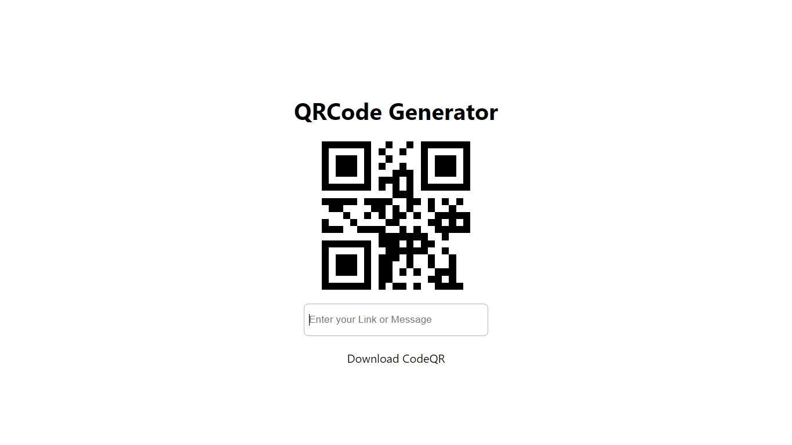

# QR Code generator using React JS

(En) I hope you enjoy! version 1.0.

(PT) Espero que goste! versão 1.0.

Deploy: Ainda a caminho

Abra usando o internet explorer para uma experiência melhor!.

 
  
  
  
  

